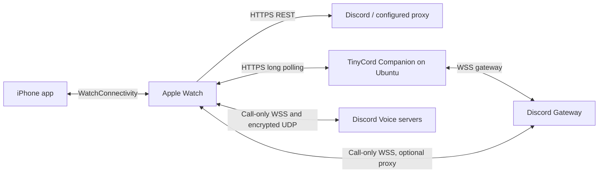

# TinyCord

<p align="center">
  <strong>A lightweight, standalone Discord client for Apple Watch with an iOS companion app.</strong>
</p>

<p align="center">
  
  
  
  
</p>

---

## 📖 Overview

**TinyCord** brings Discord messaging to your wrist. Engineered natively with **SwiftUI** and modern Swift Concurrency, TinyCord operates as a fully independent watchOS client (`WKRunsIndependentlyOfCompanionApp`) that connects to Discord over HTTPS, with optional live updates and presence through TinyCord Companion, paired with an iOS companion app for effortless account setup and customization.

Whether you are on a run, in a meeting, or away from your phone, TinyCord gives you glanceable access to direct messages, real-time updates, voice recordings, photo sharing, and customizable quick replies.

---

## ✨ Features

### ⌚ Apple Watch Client

- **Standalone Operation**:
  - Uses HTTPS REST directly (or through your configured proxy). Optional TinyCord Companion supplies live events and presence over HTTPS.
  - Functions completely on Wi-Fi or Cellular without needing your iPhone nearby.
- **Direct & Group DMs**:
  - Browse conversations with real-time unread badges, typing indicators, and message snippet previews.
  - Opening a conversation acknowledges its latest message on Discord before clearing the Watch badge. Failed acknowledgements show an error; read/unread swipe actions have been removed.
- **Compose New Message & Friends List**:
  - Tap `+` on the home screen to access your Discord friends list.
  - **One-Tap Voice & Keyboard Search**: Search friends using watchOS dictation, scribble, or keyboard. The magnifying glass stays available after a search so you can immediately enter a new query.
  - Instant direct message opening/creation.
- **Rich Messaging Experience**:
  - Full pagination of message history.
  - High-contrast, clean `@mention` styling (user, role, channel, and `@everyone` formatted in bold without distracting boxes).
  - Hyperlinks, Discord markdown formatting, and custom sticker rendering.
  - Reaction browser: inspect all emoji reactions and see who reacted; tap to add/toggle your own reactions.
  - **Call History**: DM call records show the caller, elapsed duration, and missed incoming calls. Unfinished records refresh over HTTPS, including while Companion is connected. Cached previews refresh to show the new call and voice-message labels.
- **Media & Attachments**:
  - In-line image previews with full-screen zoomable lightbox viewer (`PhotoDetailView`).
  - Audio playback directly on Apple Watch speaker or Bluetooth headphones.
- **Multiple Reply Modes**:
  - **Dictation & Keyboard**: Native watchOS text input.
  - **Quick Reply Presets**: One-tap pills or swipe actions for fast wrist replies.
  - **Photo Attachments**: Select and upload images straight from your watch Photos library.
  - **Voice Messages**: Record up to 60-second voice notes with real-time waveform visualization, playback preview, and native audio upload.
    - Received recordings have play/pause, duration, and waveform/progress controls. M4A/AAC uses Apple playback; Discord Ogg/Opus is decoded locally with the existing Opus library. Downloads use the selected HTTPS CDN on tap and are limited to 16 MiB (Opus conversion: 20 minutes). Playback stops when leaving the conversation, recording a new message, or starting a call. Long-press a recording for reply/reaction actions.
- **Outgoing Voice Call Prototype**:
  - In a one-to-one DM, tap the phone icon and confirm the recipient in a native alert. CallKit handles system call presentation; the phone button offers mute and end-call controls during a call.
  - Supports two-way audio using Opus and DAVE encryption with a Discord user account. Incoming calls, group/guild calls, video, and automatic reconnection are not implemented.
  - Audio setup and Gateway negotiation run concurrently after CallKit activates audio. Actual call-start timing depends on the device and network; validate calls on a physical Watch. See [voice call setup and limits](docs/voice-calls.md).
- **Personalization & Theming**:
  - 7 vibrant accent color themes (Discord Blurple, Emerald Green, Amber Gold, Coral Pink, Electric Violet, Ice Blue, Ruby Red).
  - Optional action button accenting, including call and voice-message playback controls.
  - Left-aligned Custom Endpoints and Test Connection controls in Watch Settings.
  - Customizable conversation subtitles (snippets, handle, or unread status).
- **Custom Reverse Proxies & Relays**:
  - Switch between Discord Official endpoints and custom reverse proxies/CDNs directly from Watch Settings.
  - Configure a custom WSS main Gateway for voice calls. Ordinary presence and messaging continue over HTTPS through Companion or REST.

---

### 📱 iPhone Companion App

- **Discord Web Login**:
  - In-app embedded web login sheet (`WKWebView`) that captures your session token safely and securely on-device.
  - Credentials remain on your devices unless you configure a proxy or enable your own TinyCord Companion server.
- **User Profile Display**:
  - Real-time display of authenticated avatar, nickname, `@handle`, bot tag, and live connection status.
- **Token Management**:
  - Manual token entry with quick-paste support, visibility toggle, and credential testing tool.
- **Apple Watch Settings Management**:
  - Manage Quick Reply presets: add new phrases, swipe left to delete, swipe right to edit, or reset to factory defaults.
- **Custom Endpoints Management**:
  - Manage multiple API/CDN profiles, a WSS Voice Call Gateway, and an optional TinyCord Companion toggle and HTTPS address.
  - Host auto-fill generates API, CDN, and call Gateway addresses, plus Companion when enabled. A blank call Gateway uses Discord's official endpoint.
  - Default Discord Official profile is safely preserved.
- **One-Tap Watch Sync**:
  - Instant synchronization of authentication, endpoint configurations, and custom quick replies via Apple `WatchConnectivity`.

---

## 🛠️ Tech Stack

Messaging uses native Apple frameworks. The Watch's outgoing call prototype adds pinned libdave, mlspp, BoringSSL, nlohmann/json, and Opus sources; see [native voice build prerequisites](VoiceNative/README.md). The optional Ubuntu service uses Python/aiohttp, rlottie/Pillow, and Caddy:

| Area | Technologies |
| :--- | :--- |
| **Language** | Swift 5.0+ with modern `async`/`await` and `@MainActor` concurrency |
| **UI Framework** | SwiftUI (declarative state management, `NavigationStack`, `ToolbarItemGroup`, sheets) |
| **Networking** | `URLSession` HTTPS and Companion long polling; call-only Watch WebSockets and `Network` UDP |
| **Media & Audio** | `AVFoundation`, `PhotosUI`, CallKit, Opus, libdave/MLS, AES-GCM RTP encryption |
| **Device Sync** | `WatchConnectivity` (`WCSession` with real-time messages & application context fallback) |
| **Authentication** | `WebKit` (`WKWebView` with cookie / header observation), `Security` (Keychain Services) |
| **Target Platforms** | watchOS 10.0+ / watchOS 11.0+, iOS 17.0+ / iOS 18.0+ |

---

## 🧠 Working Principle & Architecture



### 1. TinyCord Companion (`PresenceClient`)

- Outside voice calls, physical watches use HTTPS only. CallKit-activated outgoing calls may open temporary main/Voice Gateway WebSockets and UDP audio. Presence and messaging never open a Watch WebSocket.
- Optional [TinyCord Companion](tinycord-companion/README.md) maintains the Discord WebSocket on Ubuntu and requests “Active on Apple Watch” with a mobile client identity for user sessions.
- Relays `MESSAGE_CREATE`, `MESSAGE_DELETE`, and `TYPING_START` using HTTPS long polling. REST polling continues if Companion is disabled or unavailable.
- The Watch renews its lease every three seconds while in the foreground. Wrist-down or a dimmed display preserves the session; entering the background disconnects it. If watchOS suspends execution, renewals can stop and the server still expires the lease after ten seconds, with cleanup checked every quarter second.
- Tokens are transient authentication input, discarded after IDENTIFY. Companion cannot reconnect without fresh authentication from the Watch. Presence appearance is controlled by Discord; the mobile indicator/activity is not guaranteed by a supported user-account API.
- To enable it, add/edit a custom endpoint profile on iPhone or Watch, turn on **TinyCord Companion**, and enter its `https://` origin. iPhone profiles sync both settings to the Watch. Existing profiles default to off.

### 2. REST API Engine (`DiscordAPIClient`)
- Communicates with Discord v10 REST API endpoints using modern Swift `async`/`await`.
- Multi-part form-data generation for sending images (`image/jpeg`, `image/png`) and audio voice notes (`audio/m4a`).
- Voice recording plays the start cue, waits one second, then begins capture. Leaving the recorder during this pause cancels capture. Recording and voice-message playback yield to active calls.
- Resolves author mentions (`<@id>`), role mentions (`<@&id>`), channel mentions (`<#id>`), and nicknames on the fly.

### 3. Bidirectional Watch Connectivity
- `PhoneSyncService` (iOS) and `WatchSyncService` (watchOS) maintain a synchronized state of credentials, quick reply templates, and endpoint profiles.
- Uses `sendMessage` for instantaneous updates when both devices are actively connected, falling back to `updateApplicationContext` / `transferUserInfo` for queued background transfer.

---

## 🔒 Security & Privacy

- **Token handling**: Tokens are saved on your devices. REST sends them to Discord or your selected proxy; enabling TinyCord Companion also sends the token to that server over HTTPS for authentication. Companion never persists or logs it and does not retain it in session state. Transient process/TLS memory is unavoidable; use only a server you trust.
- **Traffic**: REST uses your selected API endpoints. Companion uses HTTPS and owns the normal presence/message Gateway. During voice calls only, the Watch uses its configured main Gateway WSS endpoint, Discord's negotiated Voice Gateway, and encrypted UDP audio.
- **Zero Telemetry**: No analytics, ads, or tracking frameworks. Native voice dependencies handle codecs and encryption on the Watch.
- **Encryption**: Messaging uses HTTPS/TLS; calls additionally use native DAVE/MLS and AES-256-GCM RTP encryption. The XChaCha/HChaCha implementation and fallback have been removed; calls require the server's AES-GCM transport mode. Standard cryptography remains bundled, so distribution export-compliance answers must still account for those libraries.

---

## 🚀 Getting Started

### Prerequisites

- **Mac** running a macOS version supported by your Xcode installation
- **Xcode 27**: The current project and voice sources are built and checked with its Swift compiler.
- **Voice build tools**: CMake, Ninja, Python 3.12+, and internet access for the first pinned native dependency download. Install CMake and Ninja with `brew install cmake ninja`; the Watch build phase fetches and compiles the pinned native sources automatically.
- **iOS Device / Simulator**: iOS 17.0 or later
- **Apple Watch / Simulator**: watchOS 10.0 or later
- An active Apple Developer Account (free or paid) for signing and running on physical hardware.

### Building & Running

1. **Clone the Repository**:
   ```bash
   git clone https://github.com/maoawa/tinycord.git
   cd tinycord
   ```

2. **Open in Xcode**:
   ```bash
   open TinyCord.xcodeproj
   ```

3. **Configure Code Signing**:
   - In Xcode, select the **TinyCord** project in the Project Navigator.
   - For both targets (**TinyCord** and **TinyCord Watch App**):
     - Go to the **Signing & Capabilities** tab.
     - Select your Apple Developer Team.
     - Update the **Bundle Identifier** prefix if necessary.

4. **Select Target & Run**:
   - To test on Apple Watch: Select the **TinyCord Watch App** scheme and choose your paired Apple Watch or watchOS Simulator.
   - Press **Cmd + R** to build and launch!
   - Use a physical Watch for call testing. The simulator can fail to activate CallKit audio, preventing the call from connecting.

---

## 📱 How to Log In

1. Launch **TinyCord** on your iPhone.
2. Tap **Log in with Discord Web**.
3. Complete authentication in the secure web view. TinyCord will automatically capture your session token and display your profile.
4. *(Alternatively)* Paste your token manually into the **Discord Credentials** section.
5. Tap **Test Connection** to verify.
6. Tap **Sync to Apple Watch** in the Apple Watch section to push your login and preferences directly to your watch.

---

## 📄 License

This software is **proprietary** and source-available for code review, personal evaluation, and security audit purposes only. No modifications, redistributions, reposting, or commercial use are permitted. See the [LICENSE](LICENSE) file for the full terms and restrictions.

Third-party voice dependencies retain their own licenses, included in [ThirdPartyLicenses](TinyCord%20Watch%20App/ThirdPartyLicenses) and the vendored headers.

---

## ⚠️ Disclaimer

TinyCord is an independent client and is **not** affiliated, associated, authorized, endorsed by, or in any way officially connected with Discord Inc. Discord and all related trademarks and logos are the registered trademarks of Discord Inc. Use at your own discretion in compliance with Discord Terms of Service.

### Chat media loading

Chat media waits for the initial scroll to the latest messages, then loads only
items intersecting the viewport, bottom-first and one at a time. Photos, animated
stickers/GIFs, avatars and link thumbnails share this policy. Older off-screen
media is deferred until you scroll to it; there is no history media prefetch.
Existing memory/disk caches are reused. Downloads already started while visible
may finish and cache their result after scrolling away. Explicitly opening a
photo uses the detail viewer independently of the chat queue.

Run `bash tests/check-chat-media.sh` to check viewport gating, bottom-first order,
serial loading, scroll admission and cancellation behavior.

### Discord read acknowledgements

Opening a conversation sends an authenticated Discord REST ACK for its latest
message before clearing the Watch badge. Failed requests leave the badge
unchanged and display an error. There are no read/unread swipe actions.
These are user-account endpoints, not bot API features. The channel-list REST
response does not include read cursors, so fetching read-state changes made on
other clients is not yet implemented; this is not full bidirectional badge sync.

Run `bash tests/check-read-state.sh` for mocked HTTP and cursor checks.

### Voice and endpoint checks

- `bash tests/check-message-recordings.sh`: Message metadata, call summaries, signed CDN URLs, M4A loading, and synthetic mono/stereo Ogg/Opus decoding, including duration, pitch, and damaged files.
- `bash tests/check-voice.sh`: Native Opus/DAVE/AES-GCM round trips, audio buffering, protocol checks, and absence of removed XChaCha/HChaCha symbols.
- `bash tests/check-profiles.sh`: Profile migration, Watch/iPhone compatibility, and HTTPS/WSS endpoint validation.
- `python3 tests/check-call-background.py`: Watch CallKit audio/VoIP background declarations.

The native voice checks run on an Apple Silicon Mac. They use local synthetic data and do not place Discord calls. Physical-device testing is still needed for audio routes, background behavior, and call-start latency.
